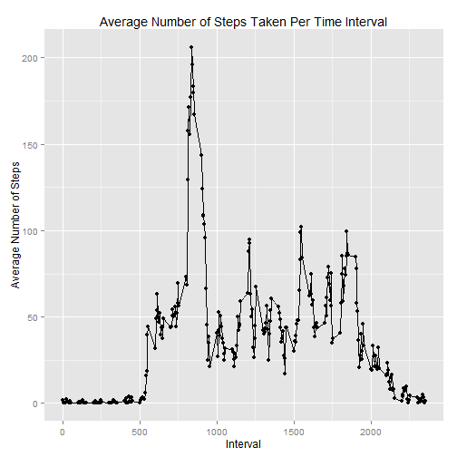
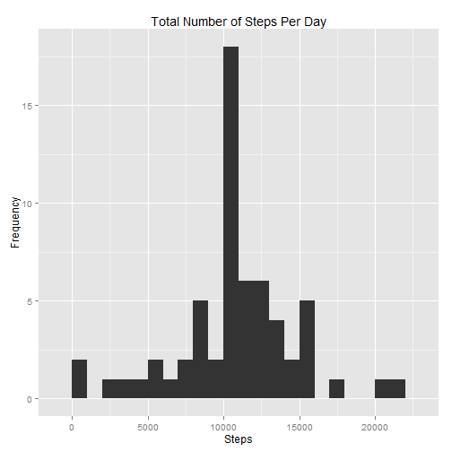
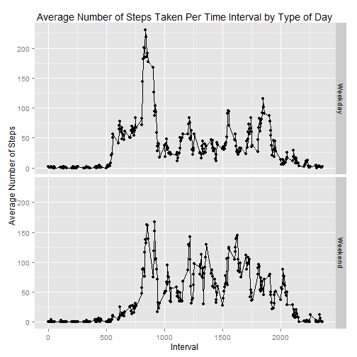

With recently developed devices such as the Fitbit, Nike Fuelband and Jawbone Up, data for personal activity can now be collected and analyzed.  The following analysis will answer the following questions about one anonymous individual from October and November of 2012:

- What is the mean total number of steps taken per day?
- What is the average daily activity pattern?
- After imputing missing values, what is the impact on the total number of steps per day for this particular individual?
- Are there differences in activity patterns between weekdays and weekends?

###What is the mean total number of steps taken per day?
To begin the data analysis, the activity data was loaded in using the function read.csv().  With this data frame, the function tapply() was used to sum the total number of steps per day over the two month period.


```r
activity <- read.csv("activity.csv")
steps <- tapply(activity$steps, activity$date, sum, na.rm=TRUE)
```

To examine the distribution of the total number of steps taken each day, a histogram was constructed using the qplot() function in the R package ggplot2. The mean and median of the distribution were calculated using their respective functions, mean() and median(). 


```r
library(ggplot2)
qplot(steps, main="Number of Steps per Day", xlab="Steps", ylab="Frequency",
     binwidth=1000)
```

 

```r
mean = round(mean(steps), 2)
median = median(steps)
```
The mean total number of steps per day for this particular individual was found to be 9354.23 steps and the median 10395 steps.

###What is the average daily activity pattern?

To investigate the average daily activity pattern, the average number of steps per time interval over the two month period was taken using the tapply() function.  Using the melt() function in the reshape2 package, the vector (avgsteps) returned by tapply() was converted into a data frame with one column containing the interval and the other column containing the average number of steps.  These columns were renamed accordingly using the rename() function in the package plyr.


```r
library(reshape2)
library(plyr)
avgsteps <- tapply(activity$steps, activity$interval, mean, na.rm=TRUE)
avgsteps <- melt(avgsteps)
avgsteps <- rename(avgsteps, c("Var1"="Interval", "value"="Steps"))
```

Using the new data frame of average steps for each time interval, a time series plot was constructed using the qplot() function.


```r
qplot(Interval, Steps, data=avgsteps, ylab="Average Number of Steps",
      main="Average Number of Steps Taken Per Time Interval") + 
  geom_line()
```

 

```r
max <- avgsteps[avgsteps$Steps==max(avgsteps$Steps),][[1]]
avg <- round(avgsteps[avgsteps$Steps==max(avgsteps$Steps),][[2]],2)
```

From the plot, we can see that there is a peak at the time interval 835, with an average of 206.17 steps.

###After imputing missing values, what is the impact on the total number of steps per day for this particular individual?


```r
missing <- sum(is.na(activity$steps))
```
In this particular data set, 2304 observations had missing values for the number of steps on that day in that time interval.  As a method of imputation, each missing value was replaced with its respective average number of steps for that time interval using a for loop and the averages calculated in the previous question.


```r
imputeact <- activity
for(i in 1:length(activity$steps)) {
  if(is.na(activity$steps[i]==TRUE)) {
    imputeact$steps[i] <- avgsteps$Steps[avgsteps$Interval    ==activity$interval[i]]
  }
}
```

With the newly imputed data, the same analysis was run as previously, with a histogram of the total steps taken each day and the mean and median of the data set calculated.


```r
imputesteps <- tapply(imputeact$steps, imputeact$date, sum, na.rm=TRUE)

qplot(imputesteps, main="Total Number of Steps Per Day", xlab="Steps",
      ylab="Frequency", binwidth=1000)
```

 

```r
meanimpute <- round(mean(imputesteps),2)
medianimpute <- round(median(imputesteps),0)
```

As would be expected, both the median and the mean rise with the newly imputed data set.  The mean is now 10766.19 steps and the median is 10766 steps.

###Are there differences in activity patterns between weekdays and weekends?

In order to address this question, a new factor variable was created to indicate whether the particular date was a weekday or weekend by first converting the date into a date type in R and then applying the function weekdays().


```r
date <- as.Date(imputeact$date)
imputeact$day <- weekdays(date) 

for(i in 1:length(imputeact$day))
if(imputeact$day[i]=="Saturday" | imputeact$day[i]=="Sunday") {
  imputeact$daytype[i]="Weekend"} else { 
    imputeact$daytype[i]="Weekday"
  }
```

The average steps per day was then calculated for weekdays and weekends for each time interval and converted to a data frame using the melt() function.  Variables within the data frame were renamed to better represent the data in the columns.


```r
avgstepsday <- with(imputeact, tapply(steps, list(interval, daytype),mean))
avgstepsday <- melt(avgstepsday)
avgstepsday <- rename(avgstepsday, c("Var1"="Interval", "Var2"="Weekday", "value"="Steps"))
```
To evaluate whether there was a difference in activity between weekdays and weekends, a panel plot was constructed using qplot() in ggplot2.

```r
qplot(Interval, Steps, data=avgstepsday, ylab="Average Number of Steps",
      main="Average Number of Steps Taken Per Time Interval by Type of Day") + 
  geom_line() +
  facet_grid(Weekday~.)
```

 

Average activity tends to be roughly the same during the beginning and end of the recorded time intervals.  The weekend intervals has a lower peak in the first half of the day, but tends to be higher during the second half of the day.
